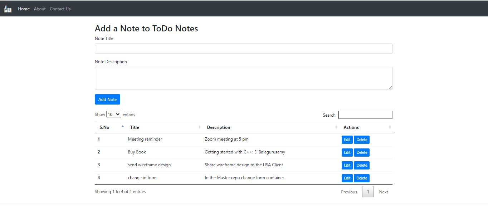
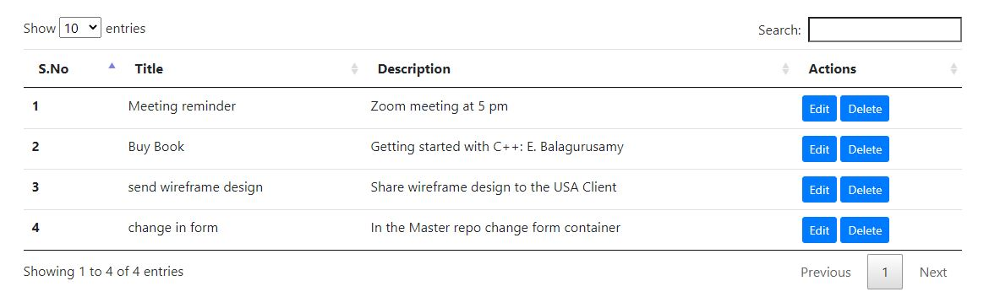
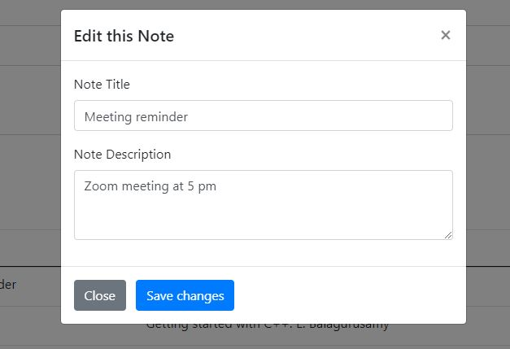
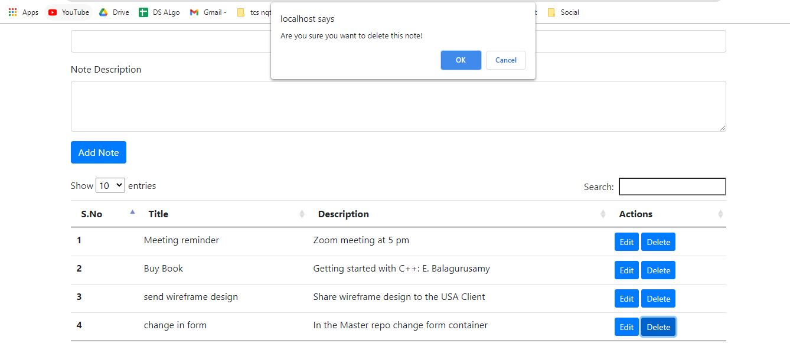

## ToDo Note App
<h3>This ToDo Note app helps to maintains todo list or some reminders</h3>
 

## Functionality
<h4> Add Task   </h4>
<h4> Edit Task  </h4>
<h4> Delete Task  </h4>
<h4> Search Task  </h4>

## Resources
[DataBase Schema](https://github.com/am-Anmol/ToDo-Note-App/blob/master/Database%20Schema.docx)  
[DataBase Structure](https://github.com/am-Anmol/ToDo-Note-App/blob/master/Database%20file.sql)

## ScreenShots:
<h4> Home Page   </h4>

  

<h4> Task   </h4>

  

<h4> Edit    </h4>

  

<h4> Delete   </h4>

  

